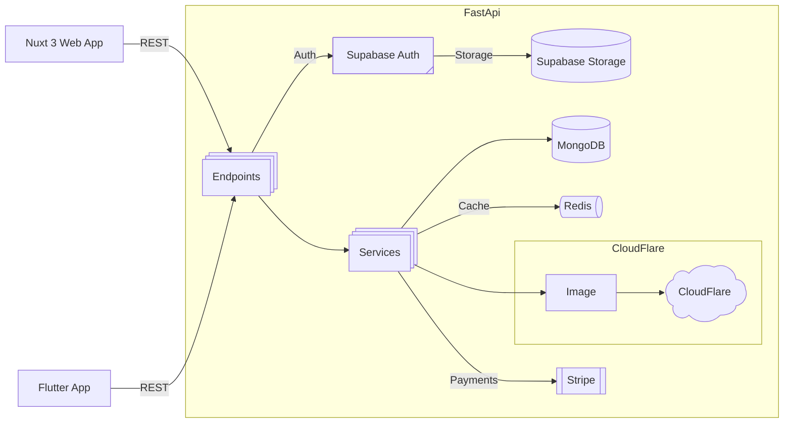

# 🌐 RecipeShare Frontend

## Overview

The frontend consists of a **Nuxt 3 web app** and a **Flutter mobile app**, both consuming the same FastAPI backend.

The goal is consistent business logic across platforms while allowing platform-specific UI and UX.

## Features

- User authentication via Supabase
- Recipe discovery, search, and filtering
- Likes, comments, and threaded replies
- User profiles and saved recipes
- Subscription-aware UI
- SEO-friendly recipe pages (Nuxt)

## Web Stack (Nuxt 3)

- Nuxt 3 + Vue 3
- Tailwind CSS / Nuxt UI
- `useAsyncData` for SSR + SEO
- API service abstraction layer
- Auth-aware composables

## Local Development

```bash
# npm
npm install

# pnpm
pnpm install

# yarn
yarn install

# bun
bun install
```

Start the development server on `http://localhost:3000`:

```bash
# npm
npm run dev

# pnpm
pnpm dev

# yarn
yarn dev

# bun
bun run dev
```

## Configuration

```env
NUXT_PUBLIC_API_BASE=http://localhost:8000/api
NUXT_PUBLIC_SUPABASE_URL=
NUXT_PUBLIC_SUPABASE_KEY=
```

# 🏗️ System Architecture Diagram


